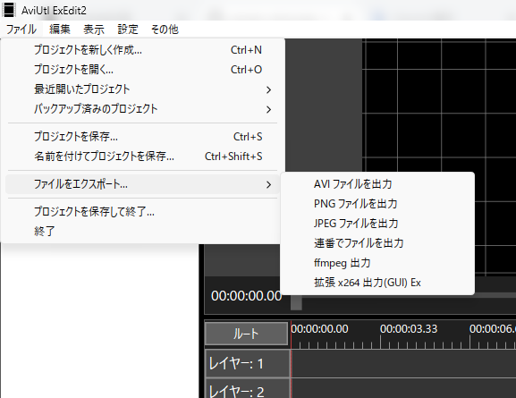

# AviUtl2 (AviUtl ExEdit2) 非公式言語ファイル
## Japanese_Mod.aul2 について
個人的に修正した [AviUtl2 (AviUtl ExEdit2)](https://spring-fragrance.mints.ne.jp/aviutl/) の日本語言語ファイルとその他です。<br>
Windows で標準的に使用されている日本語のテキストに修正 (フォルダー、名前を付けて保存、「全て」の綴りを「すべて」に変更) やダイアログが表示されるコンテキストメニューに三点リーダー追加など「こうした方が良いのでは？」と思う箇所を個人的に弄ってます。ただでさえ初心者がとっつきにくいのあるしね…



## Japanese_Mod_Emoji.aul2 について
UI が基本的に味気ないのでメニュー部分に絵文字を入れた**だけ**のバージョンです。<br>
適した絵文字に限りがあるのでコンテキストメニューは入れてません。


## 言語ファイルの内容について
言語ファイルである、aul2 ファイルは UTF-8 なテキストファイルです。<br>
UTF-8 に対応したテキストエディタを使用すれば、翻訳やテキストの修正が簡易的に行えます。

## ファイルのインストールと設定
プレビュー編集画面にドラッグ&ドロップまたは、`C:\ProgramData\aviutl2\Language` にファイルを配置で言語が追加できます。<br>
`設定 -> 言語の設定`を選択し、Japanese_Mod を選択で適用されます。

### 翻訳のサンプル
左側に**ソースとなる日本語のテキスト**、イコールの隣の**右側に翻訳後のテキスト**という構成です。<br>
`Root、Layer、Scene、OK、Cancel` はセミコロンで除外されているのでテキストを変更するには、左側のテキストのセミコロンを外す必要があります。

> [!IMPORTANT]
> `スクリプト情報=` の箇所は、スクリプトのカラム部分にも`スクリプト情報`のテキストが適用されるバグがあります。
> 回避の手段としてその箇所を「プラグイン」「スクリプト」とシンプルにしています。
>
> 日本語以外の言語の場合は時間制御メニューの`等速移動`、`加速移動`、`減速移動`、`加減速移動`のテキストが変更できないバグも存在します。
> こちらのバグはテキストの置換での対処ができないため、仕様と思うしかないかもしれません。
>
> Beta 11 からテキストの欠落がありました。<br>
> `ダイアログをEnterキーで決定`のテキストが公式の英語に入っていないことで**日本語のままになる問題**があります。
> ここで公開しているファイルはその問題を修正してあります(ブランクファイル含め)。

```
ファイル=ファイル
プロジェクトを新規作成=プロジェクトを新しく作成
プロジェクトを開く=プロジェクトを開く
最近使ったプロジェクト=最近開いたプロジェクト
バックアップしたプロジェクト=バックアップ済みのプロジェクト
プロジェクトを保存=プロジェクトを保存
プロジェクトを別名で保存=名前を付けてプロジェクトを保存
ファイル出力=ファイルをエクスポート
プロジェクトを保存して終了=プロジェクトを保存して終了
Root=ルート
Layer=レイヤー: 
Scene=シーン:
```
## English_GPT.aul2 について
GPT を使用と自分の能力を駆使して英語訳したバージョンのファイルです。<br>
標準で入っている言語ファイルは余分な空白やテキストの間違いがあったので、できる限り修正した物です。<br>
`設定 -> 言語の設定`を選択し、English_GPT を選択で適用されます。


#### English (GPT)
`English_GPT.aul2` is English translated language file, created using GPT and my own skills.<br>
The standard included language file had extra spaces and text errors, so this version has been corrected as much as possible.<br>
To apply it, go to `設定 -> 言語の設定` and select `English_GPT`.

## Blank_Language.aul2 について
今後、他の言語に翻訳する方用のファイルです。<br>
**右側の翻訳済みのテキストを消した状態**で、**翻訳すべきテキストのソースのみ**になっています。

**翻訳のサンプル**を元に **Blank_Language.aul2** を編集するとその言語に訳せます。

#### English (GPT)
This file is for those who want to **translate into other languages in the future**.<br>
It contains only the source text to be translated, with the **right-side translated text removed**.

You can translate it into any language by editing **Blank_Language.aul2** using the **translation sample as a reference**.

## Tips
翻訳するテキストをこのように変更することで一般的なキー操作を割り当てできます。<br>
バージョン情報は英語綴りで`About`であり、`バージョン情報(&A)`と一般的な物にしましょう。<br>
その他の英語はEtcになっていますが、本来の英語では`Misc (Miscellaneous)`なので`その他(&M)`にしています。

#### 日本語
日本語は括弧で囲いましょう。
```
動画ファイル=動画ファイル(&V)
画像ファイル=画像ファイル(&I)
音声ファイル=オーディオファイル(&A)
テキスト=テキスト(&T)
図形=図形(&F)
シーン=シーン(&C)
フレームバッファ=フレームバッファー(&F)
直前オブジェクト=直前のオブジェクト(&P)
その他=その他(&M)
プラグイン情報=プラグインの一覧(&P)…
スクリプト情報=スクリプトの一覧(&S)…
バージョン情報=バージョン情報(&A)…
```

#### English
英語は括弧で囲う必要はありません。
```
動画ファイル=&Video File
画像ファイル=&Image File
音声ファイル=&Audio File
テキスト=&Text
図形=&Figure
シーン=S&cene
フレームバッファ=&Frame buffer
直前オブジェクト=&Previous object
その他=&Misc
プラグイン情報=&Plugin List…
スクリプト情報=&Script List…
バージョン情報=&About…
```

## 更新履歴
- Beta 14 に対応
- テキストを修正
- ダイアログが表示されるコンテキストメニュー項目に三点リーダーを追加、… が付いているテキストを見るだけで把握可能になっています (参考: https://qiita.com/yaju/items/26e97fb770c97876194a)

## 言語ファイルの改変や再配布について
改変や再配布を行うのは自由にしてくれて構いません。<br>
むしろ、Premiere Pro 風にしたり DaVinci Resolve 風に改変しても良い奴です。
